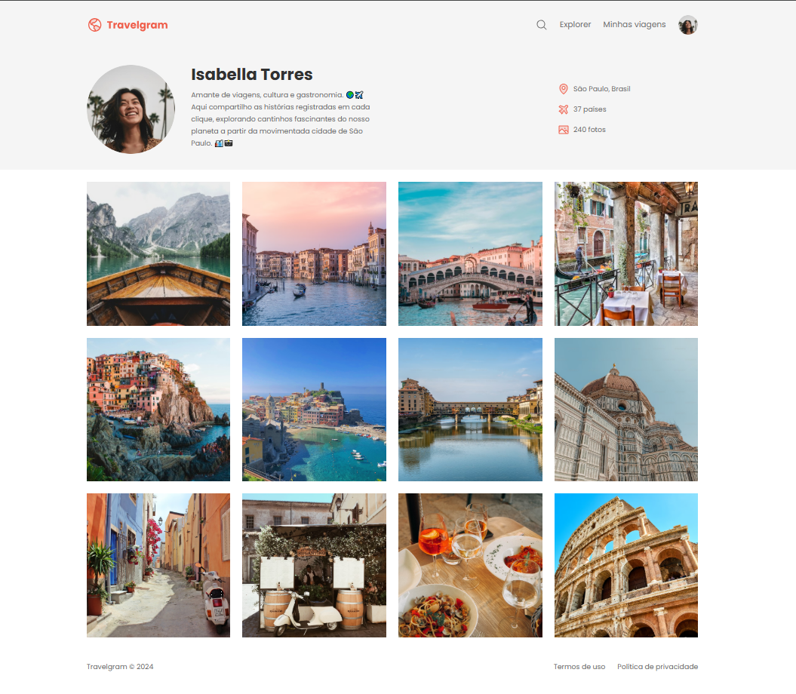

# Perfil de Viagens | Travelgram

## Descrição

Uma página simples no estilo de um perfil de rede social, criada para alocação e exibição de fotos de viagens. Este projeto é uma base inicial, com potencial para melhorias futuras.

## Demonstração



## Tecnologias Utilizadas

- HTML
- CSS
- Figma (para prototipação)
- DevTools (para inspeção e ajustes)

## Instalação

Siga os passos abaixo para clonar e executar o projeto localmente:

1. Clone o repositório:
   ```bash
   git clone https://github.com/devmoisessantos/projeto-perfil-de-viagens.git
   ```
2. Navegue até o diretório do projeto:
   ```bash
   cd projeto-perfil-de-viagens
   ```
3. Abra o arquivo `index.html` no navegador.

## Funcionalidades

- Estrutura inicial para um perfil de viagens.
- Design simples para exibição de imagens.

## Contato

Se tiver dúvidas ou sugestões, entre em contato:

- [LinkedIn](https://linkedin.com/in/devmoises-santos)
- Email: 062moises@gmail.com
